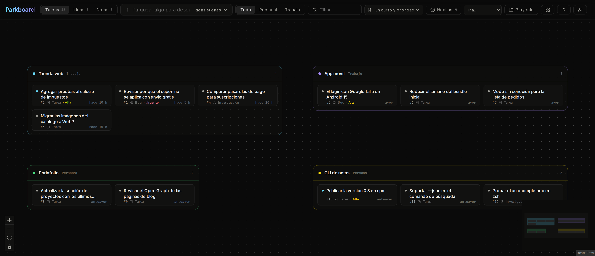

# Parkboard

An infinite canvas for the things you park for later: tasks, ideas, bugs and research, grouped by project,
with a CLI so your coding agents can park things for you when you say "let's leave that for later".



## Why

When you work with an AI agent (Claude Code, Codex or any other), one task keeps spawning others: a bug you spot
while fixing something else, an idea for later, a check you should run before shipping. You stay on the main
task, and by the end of the session those side tasks are lost in the conversation.

Parkboard keeps them in one place. The agent parks each one as it comes up, with enough context to pick it up cold
and a link back to the session where it was born. Every pending item stays visible on the canvas, and getting back
to it is one card away.

- **Canvas**: projects are resizable groups; cards move between them by dragging. Each card has status, priority,
  kind, notes, links, tags, and where it was born (origin and session).
- **Tasks, Ideas and Notes views**: the canvas shows one at a time (bugs and research go with tasks), so ideas and notes do not crowd the work.
- **Personal and work areas**, text filter, done cards hidden by default.
- **CLI `park`** with no dependencies: JSON when piped, `--dry-run` on writes, `park schema` for agents.
- **Private by default**: Clerk sign-in plus an email allowlist (`PARKBOARD_ALLOWED_EMAILS`). The CLI uses API
  keys stored as SHA-256 hashes.

Stack: Next.js 16, React 19, Tailwind 4, React Flow, Prisma 7 on Postgres, Clerk.

## Run it

```bash
pnpm install
cp .env.example .env          # fill DATABASE_URL, Clerk keys and your email
pnpm exec prisma migrate deploy
pnpm dev
```

## CLI

```bash
pnpm key:create my-laptop     # prints a pk_… key once
ln -s "$PWD/cli/park.mjs" ~/.local/bin/park
park config --url https://your-board.example.com --key pk_…
park add "Try surfacer on the recon report" -p google-flow --kind research --priority high
park ls
park done <id>
```

Agents: `park schema` prints every command, flag and exit code as JSON.

## API

All routes accept `Authorization: Bearer pk_…` or a Clerk session.

| Method | Path | |
|---|---|---|
| GET | `/api/board` | projects and cards |
| GET, POST | `/api/cards` | `?status=open\|idea\|pending\|doing\|done&project=&q=` |
| GET, PATCH, DELETE | `/api/cards/:id` | |
| GET, POST | `/api/projects` | |
| PATCH, DELETE | `/api/projects/:id` | deleting a project moves its cards to the inbox |
